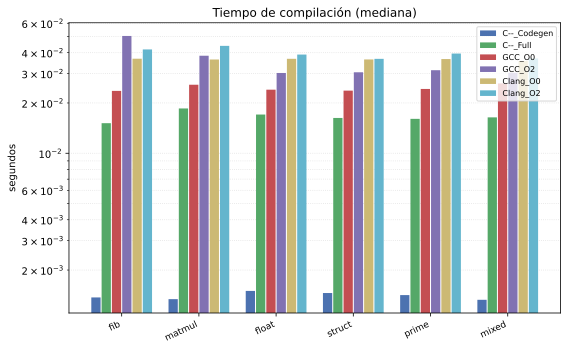
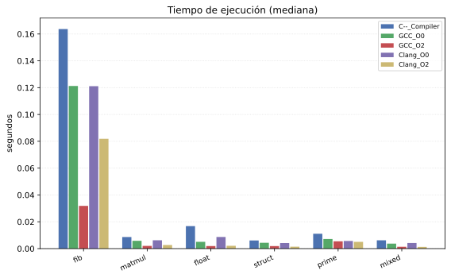
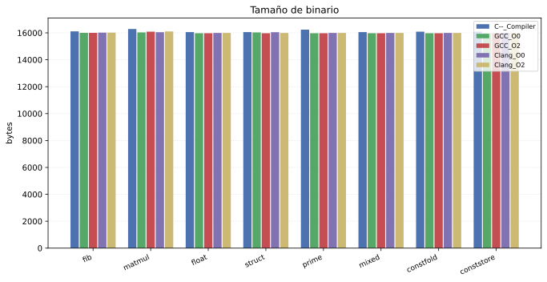

# c--

Implementación de compilador para un subset de C.

## Requisitos

- g++ con soporte para C++17
- gcc (para generar ejecutables con `--exec`)
- make

## Compilar

```bash
make
```

Genera el ejecutable `c--`. Los archivos `.o` intermedios se eliminan automáticamente.

## Uso

```
./c-- <archivo.c--> [opciones]
```

### Flags

| Corta | Larga         | Descripción                                                  |
|-------|---------------|--------------------------------------------------------------|
| `-t`  | `--tokens`    | Imprime los tokens y termina                                 |
| `-a`  | `--ast`       | Imprime el AST y termina                                     |
| `-c`  | `--codegen`   | Imprime el assembly x86-64 y termina                         |
| `-A`  | `--all`       | Imprime tokens, AST y assembly                               |
| `-e`  | `--exec`      | Genera ejecutable a partir del assembly                      |
|       | `-o <archivo>`| Guarda texto de salida (sin `--exec`); nombre del binario (con `--exec`) |

### Comportamiento de `-o`

- **Sin `--exec`**: guarda la salida del modo en el archivo (tokens, AST o assembly).
- **Con `--exec`**: define el nombre del ejecutable generado; la salida de texto va a stdout.
- **Sin `-o`**: la salida de texto va a stdout.

### Ejemplos

```bash
./c-- programa.c--                # Assembly por stdout
./c-- programa.c-- -o salida.s    # Assembly a salida.s
./c-- programa.c-- -c             # Solo assembly por stdout
./c-- programa.c-- -c -o salida.s # Solo assembly a salida.s
./c-- programa.c-- -t             # Solo tokens por stdout
./c-- programa.c-- -t -o salida.txt # Solo tokens a salida.txt
./c-- programa.c-- -a             # Solo AST por stdout
./c-- programa.c-- -A             # Tokens + AST + assembly por stdout

./c-- programa.c-- --exec                  # Assembly por stdout + binario programa.out
./c-- programa.c-- --exec -o ejecutable    # Assembly por stdout + binario ejecutable
./c-- programa.c-- -A --exec               # Tokens + AST + assembly + binario programa.out
./c-- programa.c-- -A --exec -o ejecutable # Todo por stdout + binario ejecutable
```

## Pipeline

1. **Scanner** → tokeniza el fuente
2. **Parser** → construye el AST
3. **TypeChecker** → verifica tipos y resuelve tipos de expresiones
4. **ConstantFolding** → evalua expresiones constantes en tiempo de compilación
5. **GenCodeVisitor** → genera assembly x86-64
6. **gcc** (con `--exec`) → ensambla y linkea a ejecutable

---

# Informe del Proyecto

**Curso:** Compiladores
**Proyecto:** Diseño e implementación del compilador `C--`
**Universidad:** UTEC

## Índice

1. [Documentación del lenguaje](#1-documentación-del-lenguaje)
2. [Optimizaciones aplicadas](#2-optimizaciones-aplicadas)
3. [Resultados](#3-resultados)
4. [Conclusiones generales](#4-conclusiones-generales)

## Introducción

`C--` es un compilador para un subconjunto del lenguaje C, extendido con
punteros, arreglos multidimensionales, structs, `long long` y `unsigned`.
El compilador implementa un pipeline clásico de cinco etapas (scanner →
parser → typechecker → constant folding → generación de código) y
produce código ensamblador x86-64 (sintaxis AT&T/GAS), que puede
ensamblarse y enlazarse a un ejecutable nativo mediante `gcc`.

Este informe documenta el diseño del lenguaje, las optimizaciones
implementadas sobre el código generado, y una comparación empírica de
rendimiento frente a `gcc` y `clang`.

## 1. Documentación del lenguaje

### 1.1 Descripción general

`C--` es un subset de C con las siguientes extensiones y restricciones
respecto al C estándar:

| Se soporta | No se soporta |
|---|---|---|
| Tipos primitivos (`int`, `char`, `float`, `double`, `bool`, `void`, `long`), `unsigned` | Unions, enums |
| Punteros (`T*`), arreglos multidimensionales (`T[n][m]`) | Punteros a función |
| Structs (`struct Nombre { ... };`) | Herencia / OOP |
| `malloc` / `free`, `sizeof`, `printf` | Librería estándar (`stdio.h`, `stdlib.h`, etc.) |
| `if`/`else`, `switch`, `while`, `do-while`, `for`, `break`/`continue` | Asignación compuesta (`+=`, `-=`, ...), operador ternario |

### 1.2 Gramática formal (EBNF)

```
// ============================================================
// Programa
// ============================================================
program         = decl*

decl            = fundec | vardec | struct_decl

fundec          = type ID "(" param_list ")" body
vardec          = type ID arrsuf [ "=" expr ] ";"
struct_decl     = "struct" ID "{" vardec* "}" ";"

// ============================================================
// Tipos
// ============================================================
type            = btype "*"*

btype           = "void" | "int" | "char" | "float" | "double"
                | "bool" | "long" stype

stype           = "struct" ID

arrsuf          = ("[" [ expr ] "]")*

// ============================================================
// Parámetros
// ============================================================
param_list      = param ("," param)* | ε
param           = type ID arrsuf

// ============================================================
// Sentencias
// ============================================================
stmt            = body | expr_stmt | sel_stmt | iter_stmt
                | jump_stmt | free_stmt | vardec

body            = "{" stmt* "}"
expr_stmt       = [ expr ] ";"

sel_stmt        = if_stmt | switch_stmt
if_stmt         = "if" "(" expr ")" stmt [ "else" stmt ]
switch_stmt     = "switch" "(" expr ")" "{" { case_clause | default_clause } "}"
case_clause     = "case" expr ":" stmt*
default_clause  = "default" ":" stmt*

iter_stmt       = while_stmt | do_stmt | for_stmt
while_stmt      = "while" "(" expr ")" stmt
do_stmt         = "do" stmt "while" "(" expr ")" ";"
for_stmt        = "for" "(" [ init ] ";" [ cond ] ";" [ inc ] ")" stmt
init            = expr | vardec
cond            = expr
inc             = expr

jump_stmt       = break_stmt | cont_stmt | ret_stmt
break_stmt      = "break" ";"
cont_stmt       = "continue" ";"
ret_stmt        = "return" [ expr ] ";"
free_stmt       = "free" "(" expr ")" ";"

// ============================================================
// Expresiones (precedencia descendente)
// ============================================================
expr            = assign_expr
assign_expr     = unary_expr assign_op assign_expr
assign_op       = "="
lor_expr        = land_expr ("||" land_expr)*
land_expr       = eq_expr ("&&" eq_expr)*
eq_expr         = rel_expr { ("==" | "!=") rel_expr }
rel_expr        = add_expr { ("<" | ">" | "<=" | ">=") add_expr }
add_expr        = mul_expr { ("+" | "-") mul_expr }
mul_expr        = pow_expr { ("*" | "/" | "%") pow_expr }
pow_expr        = unary_expr [ "**" pow_expr ]          // right-assoc
unary_expr      = post_expr | "++" unary_expr | "--" unary_expr
                | unary_op unary_expr
unary_op        = "&" | "*" | "-" | "!"
post_expr       = prim_expr { "[" expr "]"                      // index
                            | "(" [ arg_list ] ")"              // call
                            | "." ID | "->" ID
                            | "++" | "--" }
arg_list        = assign_expr ("," assign_expr)*
prim_expr       = ID | const | "(" expr ")"
                | "malloc" "(" expr ")"
                | "sizeof" "(" type ")"
                | "printf" "(" arg_list ")"

// ============================================================
// Constantes
// ============================================================
const           = intc | floatc | charc | boolc | str
intc            = NUM
floatc          = FNUM
charc           = "'" CHAR "'"
boolc           = "true" | "false"
str             = '"' CHAR* '"'

// ============================================================
// Tokens léxicos
// ============================================================
ID              = letter { letter | digit | "_" }
NUM             = digit digit*
FNUM            = digit digit* "." digit digit*
                  [ ("e" | "E") [ "+" | "-" ] digit digit* ]
CHAR            = printable_ascii | escape_sequence
escape_sequence = "\\" ( "'" | '"' | "\\" | "n" | "t" | "r" | "0" )
letter          = "A".."Z" | "a".."z"
digit           = "0".."9"
```

### 1.3 Sistema de tipos

| Tipo      | Palabra      | Tamaño | Observaciones                                     |
|-----------|--------------|--------|---------------------------------------------------|
| void      | `void`       | —      | Solo como retorno de función                      |
| int       | `int`        | 4      | Entero con signo                                  |
| long      | `long long`  | 8      | Entero largo con signo                            |
| char      | `char`       | 1      | Tratado como int en aritmética                    |
| float     | `float`      | 4      | Punto flotante precisión simple (SSE)             |
| double    | `double`     | 8      | Punto flotante precisión doble (SSE)              |
| bool      | `bool`       | 1      | `true` = 1, `false` = 0                           |
| unsigned  | `unsigned`   | 4      | Modificador sin signo (mapea a `int`)             |
| puntero   | `T*`         | 8      | `&x`, `*p`, `p->m`, `arr[i]` sobre puntero       |
| arreglo   | `T[n]`       | n×\|T\| | Multidimensional: `int m[2][3]`                   |
| struct    | `struct`     | ∑      | Declaración: `struct Nombre { ... };`             |
| string    | n/a          | 8      | Literal: `"hola"` → `int` (dirección en .rodata) |

**Conversiones y promociones** (`check_assign`):

| Destino (T) | Valor (V)              | Acción                      |
|-------------|------------------------|-----------------------------|
| `T`         | `T`                    | Directa (match)             |
| `T*`        | `U*` (cualquier)       | Coerción de puntero         |
| `int`       | `char` o `long`        | Promoción/truncamiento      |
| `char`      | `int` o `long`         | Truncamiento                |
| `long`      | `int`, `char` o `bool` | Promoción                   |
| `float`     | `int`, `char` o `long` | `cvtsi2ss` (int→float)      |
| `double`    | `int`, `char` o `long` | `cvtsi2sd` (int→double)     |
| `double`    | `float`                | `cvtss2sd` (float→double)   |
| `bool`      | `int`, `char` o `long` | Conversión a booleano       |
| `int`/`char`/`long` | `bool`          | Extensión                  |

En aritmética, el tipo de resultado se determina por el operando más
grande: `double` domina sobre `float`, que domina sobre `long`, que
domina sobre `int` (`char` promueve a `int`).

### 1.4 Semántica

**Scoping**: búsqueda de identificadores del scope más interno al más
externo (shadowing permitido); no se permite redeclarar una variable en
el mismo scope; funciones y structs viven en scope global y no pueden
redefinirse.

| Constructo                     | Regla                                                              |
|--------------------------------|--------------------------------------------------------------------|
| Asignación `=`                 | Tipos compatibles (ver conversiones); promoción automática         |
| Condición `if` `while` `for`   | Debe ser `bool`                                                    |
| `&&` `\|\|` `!`                | Operandos `bool`; resultado `bool`                                 |
| `==` `!=` `<` `>` `<=` `>=`    | Operandos numéricos; resultado `bool`                              |
| `+` `-` `*` `/` `%`           | Numéricos; promoción al tipo más grande                             |
| `**` potencia                  | Numéricos; exponente entero para código nativo                     |
| `[]` indexación                | Base: arreglo o puntero; índice: `int` o `char`                    |
| `.` / `->`                     | Objeto (o puntero) debe ser struct; miembro debe existir            |
| Llamada a función              | Aridad y tipos coinciden con la firma declarada                    |
| `return`                       | Tipo debe coincidir con el de retorno (o ser asignable)             |
| `break` / `continue`           | Solo dentro de `while`, `for`, `do-while` o `switch`                |
| `malloc` / `free`              | `malloc` retorna `void*`; `free` recibe `void*`                    |
| `sizeof`                       | Retorna `int` con el tamaño en bytes del tipo                      |

**Manejo de errores**: errores léxicos abortan la compilación en el
primer carácter no reconocido; errores sintácticos lanzan una excepción
con el token esperado vs. encontrado; los errores semánticos se
acumulan en `TypeChecker::errors` y, si hay al menos uno, el compilador
termina con `exit(1)` sin generar código.

### 1.5 Operadores

| Símbolo | Precedencia | Asoc.     | Descripción                |
|---------|-------------|-----------|-----------------------------|
| `=`     | 1           | derecha   | Asignación                 |
| `\|\|`  | 2           | izquierda | OR lógico                  |
| `&&`    | 3           | izquierda | AND lógico                 |
| `==` `!=` | 4         | izquierda | Igualdad / desigualdad      |
| `<` `>` `<=` `>=` | 5   | izquierda | Comparación relacional      |
| `+` `-` | 6           | izquierda | Suma / resta                |
| `*` `/` `%` | 7       | izquierda | Multiplicación / división / módulo |
| `**`    | 8           | derecha   | Potencia (exponenciación)   |

Unarios: `-` (negación aritmética), `!` (negación lógica), `&`
(dirección), `*` (desreferencia), `++x`/`--x` (pre) y `x++`/`x--`
(post). No existen operadores de asignación compuesta (`+=`, `-=`, etc.)
ni el operador ternario.

### 1.6 Arquitectura del compilador

```
Código fuente
    │
    ▼
Scanner (lexer) ──► tokens
    │
    ▼
Parser (recursive descent) ──► AST (Program*)
    │
    ├─► TypeChecker ──► verificación semántica + offsets de stack frame
    ├─► ConstantFolding ──► plegado de expresiones constantes
    └─► GenCodeVisitor ──► código ensamblador x86-64 (AT&T/GAS)
```

El AST usa **triple dispatch**: cada nodo implementa `accept` para tres
visitors (`Visitor` de interpretación, `TypeVisitor` de typechecking,
`CodeGenVisitor` de generación de código), identificados en tiempo de
ejecución con `dynamic_cast`. Cada variable recibe un slot de pila de 8
bytes (o su tamaño real si es mayor), y el frame se alinea a 16 bytes,
evitando la complejidad de un *bin packing* de offsets sin penalización
práctica en x86-64.

Ver [`docs/lenguaje.md`](docs/lenguaje.md) para el detalle completo de
la jerarquía de nodos del AST, el manejo de l-values (`captureLVal` /
`storeTarget`) y la gestión de memoria del árbol.

### 1.7 Ejemplos

**Struct:**

```c
struct Punto {
    int x;
    int y;
};

int main() {
    struct Punto pt;
    pt.x = 10;
    pt.y = 20;
    printf("%d\n", pt.x + pt.y); // esperado: 30
    return 0;
}
```

**Long long:**

```c
int main() {
    long long big;
    big = 100000;
    printf("%d\n", big); // esperado: 100000
    return 0;
}
```

**Unsigned:**

```c
int main() {
    unsigned u;
    u = 42;
    printf("%d\n", u); // esperado: 42
    return 0;
}
```

### 1.8 Cobertura de pruebas

El lenguaje se valida con 20 pruebas de integración
(`tests/integracion/`), cada una enfocada en una característica:

| # | Test | Cubre |
|---|------|-------|
| 01 | `test01_funciones` | Declaración y llamada a funciones |
| 02 | `test02_control_flujo` | `if`/`else`, `while`, `for` |
| 03 | `test03_variables_ops` | Variables y operadores aritméticos |
| 04 | `test04_operadores_unarios` | `-`, `!`, `++`, `--` |
| 05 | `test05_tipos_char` | Tipo `char` |
| 06 | `test06_structs` | Declaración y acceso a `struct` |
| 07 | `test07_arrays` | Arreglos unidimensionales |
| 08 | `test08_malloc_free` | Memoria dinámica |
| 09 | `test09_switch` | `switch` / `case` / `default` |
| 10 | `test10_expresiones_complejas` | Precedencia y anidamiento de expresiones |
| 11 | `test11_pointers` | Punteros, `&`, `*`, `->` |
| 12 | `test12_sizeof` | Operador `sizeof` |
| 13 | `test13_type_inference` | Declaración con tipo explícito |
| 14 | `test14_lambda` | Funciones como reemplazo de lambdas |
| 15 | `test15_templates` | Struct y función simple (sin templates) |
| 16 | `test16_scope` | Scoping y shadowing |
| 17 | `test17_multidim_arrays` | Arreglos multidimensionales |
| 18 | `test18_type_promotion` | Promoción de tipos numéricos |
| 19 | `test19_strings` | Literales de string |
| 20 | `test20_float_double` | Aritmética `float`/`double` |
| 21 | `test21_long_unsigned` | Tipo `long long` y `unsigned` |
| 22 | `test22_unsigned_ops` | Operaciones aritméticas con `unsigned` |

## 2. Optimizaciones aplicadas

> **Sección pendiente.** Se documentará en una siguiente iteración de
> este informe el detalle de las optimizaciones implementadas sobre el
> código generado (actualmente incluye *constant folding* sobre
> expresiones literales — ver `ConstantFolding.cpp`).

## 3. Resultados

Comparación empírica del compilador `C--` contra **GCC** y **Clang** en
tiempo de compilación, tiempo de ejecución y tamaño de binario. El
detalle completo de la metodología, scripts y datos crudos vive en
[`comparativa/`](comparativa/comparativa.md).

### 3.1 Metodología

**Benchmarks** (cada uno existe en par equivalente `benchmarks_cnn/*.cnn`
y `benchmarks_c/*.c`):

| Nombre | Descripción |
|--------|------------|
| bench_fib | Fibonacci recursivo (n=35) — recursión y llamadas a función |
| bench_matmul | Matmul 80×80 — arreglos 2D y loops anidados |
| bench_float | Suma de cuadrados float (n=500k) — aritmética float |
| bench_struct | Struct + puntero en loop (n=500k) — structs, punteros y `->` |
| bench_prime | Criba de primos hasta 40k — loops, módulo, condicionales |
| bench_mixed | Struct con int y float (n=150k) — tipos combinados |

**Métricas**:

| Métrica | Descripción |
|---------|-------------|
| Compilación (codegen) | `c-- -c` — solo frontend + typecheck + codegen |
| Compilación (full) | `c-- --exec` — pipeline completo hasta ejecutable |
| Compilación GCC | `gcc` con `-O0` y `-O2` hasta binario |
| Compilación Clang | `clang` con `-O0` y `-O2` hasta binario |
| Ejecución | Mediana de **7 ejecuciones** (timeout 120 s por run) |
| Tamaño | Bytes del ejecutable en disco |

**Entorno**: GCC 16.1.1 (20260625), Clang 22.1.6, Python 3.14.6,
7 repeticiones por medición, timeout de ejecución de 120 s (fecha de la
medición: 2026-07-03 14:43 -05:00). La comparación es a tres vías
(`C--` / GCC / Clang).

**Limitaciones**: mediciones realizadas en un entorno Linux nativo. Las
tres rutas de compilación (`C--`, GCC, Clang) comparten el mismo costo
de *spawn* de proceso del sistema operativo, por lo que las diferencias
de tiempo de compilación reflejan directamente el trabajo de cada
compilador. `C--` solo aplica constant folding, mientras GCC -O2 y
Clang -O2 aplican decenas de passes de optimización (vectorización,
inlining, desenrollado de loops, eliminación de código muerto, etc.).
Mediciones en una sola máquina, sin normalizar por frecuencia de CPU.

### 3.2 Tiempos de compilación

| Benchmark | C-- codegen | C-- full | GCC -O0 | GCC -O2 | Clang -O0 | Clang -O2 |
|-----------|------------:|---------:|--------:|--------:|----------:|----------:|
| bench_fib | 4.3 ms | 45.2 ms | 50.9 ms | 95.3 ms | 100.3 ms | 125.4 ms |
| bench_matmul | 2.8 ms | 29.6 ms | 51.9 ms | 72.3 ms | 74.8 ms | 121.4 ms |
| bench_float | 2.6 ms | 29.4 ms | 51.6 ms | 56.0 ms | 69.8 ms | 73.4 ms |
| bench_struct | 2.7 ms | 29.2 ms | 67.0 ms | 72.3 ms | 69.2 ms | 89.7 ms |
| bench_prime | 3.2 ms | 28.9 ms | 50.8 ms | 65.4 ms | 75.2 ms | 87.3 ms |
| bench_mixed | 3.1 ms | 32.0 ms | 50.0 ms | 56.1 ms | 69.9 ms | 72.1 ms |



En modo `c-- -c` (solo parseo + typecheck + codegen), `C--` toma
consistentemente ~2.6–4.3 ms, ~15–30× menos que su propio pipeline
completo. El pipeline completo (`--exec`) delega en `gcc` para
ensamblar/enlazar, y en esta medición resultó más rápido (~28.9–45.2 ms)
que `GCC -O0`/`-O2` (~50.0–95.3 ms) y que `Clang -O0`/`-O2`
(~69.2–125.4 ms) en los seis benchmarks — una ventaja real del pipeline
completo de `C--` en este entorno.

### 3.3 Tiempos de ejecución

| Benchmark | C-- | GCC -O0 | GCC -O2 | Clang -O0 | Clang -O2 |
|-----------|----:|--------:|--------:|----------:|----------:|
| bench_fib | 129.5 ms | 100.6 ms | 24.8 ms | 90.0 ms | 50.2 ms |
| bench_matmul | 7.2 ms | 3.7 ms | 1.2 ms | 3.1 ms | 1.4 ms |
| bench_float | 14.0 ms | 4.5 ms | 1.9 ms | 7.7 ms | 1.7 ms |
| bench_struct | 6.3 ms | 3.7 ms | 1.7 ms | 3.1 ms | 1.0 ms |
| bench_prime | 6.9 ms | 5.0 ms | 6.2 ms | 6.5 ms | 5.3 ms |
| bench_mixed | 4.4 ms | 2.5 ms | 1.1 ms | 2.9 ms | 1.0 ms |



**Speedups de ejecución (vs. C--; ratio > 1 = GCC/Clang más rápido que C--):**

| Benchmark | GCC -O0 | GCC -O2 | Clang -O0 | Clang -O2 |
|-----------|--------:|--------:|----------:|----------:|
| bench_fib | 1.29× | 5.21× | 1.44× | 2.58× |
| bench_matmul | 1.96× | 5.86× | 2.30× | 5.23× |
| bench_float | 3.11× | 7.54× | 1.81× | 8.36× |
| bench_struct | 1.68× | 3.62× | 2.00× | 6.30× |
| bench_prime | 1.39× | 1.12× | 1.07× | 1.30× |
| bench_mixed | 1.72× | 3.87× | 1.50× | 4.23× |

La mediana de speedup de GCC -O2 sobre `C--` es **~4.54×**; la de Clang
-O2 es **~4.73×**. Las brechas más grandes se dan en:

- **bench_float**: GCC (7.54×) y sobre todo Clang (8.36×) vectorizan con SSE/AVX; `C--` usa SSE escalar.
- **bench_struct (6.30× Clang)** y **bench_matmul (5.86× GCC, 5.23× Clang)**: desenrollado de loops y reutilización de registros que `C--` no hace (spillea todo al stack).
- **bench_fib (5.21× GCC)** y **bench_mixed (3.87–4.23×)**: mezcla de aritmética y recursión/tipos donde GCC/Clang reutilizan registros.

En **bench_prime** la brecha es la más chica de la tabla y con una
anomalía: GCC -O2 (6.2 ms) midió más lento que GCC -O0 (5.0 ms) — ratio
de solo 1.12×. Con cargas de ~5–6 ms y 7 repeticiones, el ruido de
scheduling pesa más que el efecto real de `-O2` sobre este patrón de
loops/módulo; no debe sobre-interpretarse ese resultado puntual.

### 3.4 Tamaño de binario

| Benchmark | C-- | GCC -O0 | GCC -O2 | Clang -O0 | Clang -O2 |
|-----------|----:|--------:|--------:|----------:|----------:|
| bench_fib | 15.7 KB | 15.6 KB | 15.6 KB | 15.6 KB | 15.6 KB |
| bench_matmul | 15.9 KB | 15.7 KB | 15.7 KB | 15.7 KB | 15.7 KB |
| bench_float | 15.7 KB | 15.6 KB | 15.6 KB | 15.6 KB | 15.6 KB |
| bench_struct | 15.7 KB | 15.7 KB | 15.6 KB | 15.7 KB | 15.6 KB |
| bench_prime | 15.9 KB | 15.6 KB | 15.6 KB | 15.6 KB | 15.6 KB |
| bench_mixed | 15.7 KB | 15.6 KB | 15.6 KB | 15.6 KB | 15.6 KB |



Los binarios de `C--` son comparables a los de GCC y Clang (diferencia
de apenas un par de cientos de bytes en esta corrida); no hay una
penalización sistemática relevante.

### 3.5 Fortalezas y debilidades observadas

**Fortalezas de `C--`:**
- Compilación (parseo + typecheck + codegen) extremadamente rápida (~2.6–4.3 ms)
- Código generado claro, legible y didáctico
- Constant folding reduce expresiones constantes en tiempo de compilación

**Debilidades frente a GCC/Clang -O2:**
- Sin asignación de registros (todo spillea al stack)
- Sin vectorización SIMD
- Sin desenrollado de loops
- Sin eliminación de código muerto
- Sin inlining de funciones

## 4. Conclusiones generales

- `C--` cumple su objetivo como compilador didáctico: implementa un
  pipeline completo (scanner → parser → typechecker → constant folding
  → codegen x86-64) capaz de compilar un subset expresivo de C —
  incluyendo punteros, structs, arreglos multidimensionales, `long long`
  y `unsigned` — a código ensamblador nativo funcional.
- El costo de la simplicidad del backend se paga en tiempo de
  ejecución: sin asignación de registros, vectorización, inlining ni
  eliminación de código muerto, el código generado por `C--` es en
  mediana ~4.54× más lento que el de GCC -O2 y ~4.73× más lento que el
  de Clang -O2, con la brecha más amplia en cargas aritméticas
  vectorizables (`bench_float`) y la más estrecha en cargas dominadas
  por enteros y control de flujo (`bench_prime`).
- El tamaño de binario es prácticamente idéntico al de GCC y Clang en
  esta corrida, por lo que la ausencia de eliminación de código muerto
  no representa hoy un costo significativo en los programas de prueba.
- Las pruebas de integración (`tests/integracion/`) cubren las
  características centrales del lenguaje documentadas en la sección 1,
  dando una base de
  regresión para futuras optimizaciones (sección 2, pendiente).
